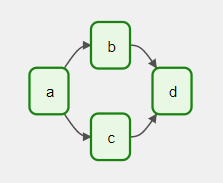

[[_TOC_]]

# Apache Airflow
[Apache Airflow](https://airflow.apache.org/docs/apache-airflow/stable/index.html) is an open source tool for workflow orchestration of complex data pipelines by enforcing correct order of execution and allocation of resources.
Airflow operates under four principles:

* **Dynamic** - Configuration as code to allow dynamic/automatic pipeline generation
* **Extensible** - Flexibility to extend the library to suit environment
* **Elegant** - lean and explicit pipelines using the [Jinja](https://jinja.palletsprojects.com/en/3.1.x/) templating engine
* **Scalable** - Modular architecture that uses a message queue for easy scaling

Airflow has an intergrated user interface to monitor and manage these workflows. Workflows are represented as Directed Acyclic Graphs(DAGs) and work to be done as Tasks which are ordered based on dependency.

Basic illustration of a DAG:

## Architectural Components

1. **Scheduler** - triggers scheduled worfklows and submits tasks to executor
2. **Executor** - runs submitted tasks
3. **Web Server** - user interface for inspecting, trigger and debugging DAGs and tasks
4. **DAG Directory** - folder with code definition of DAGs and tasks
5. **Metadata database** - stores state of scheduler, executor and webserver

A DAG has 3 types of Tasks:

1. [Operators](https://airflow.apache.org/docs/apache-airflow/stable/concepts/operators.html) - predefined tasks e.g `BashOperator` - executes bash commands, `PythonOperator` - calls python functions and `EmailOperator`- sends email
2. [Sensors](https://airflow.apache.org/docs/apache-airflow/stable/concepts/sensors.html) - subclass of operators for external event listening
3. [Taskflow](https://airflow.apache.org/docs/apache-airflow/stable/concepts/taskflow.html) decorated `@task` - custom python function

Dependencies between tasks can then be declated with either  `>>` and  `<<` operators or `set_upstream` and `set_downstream` methods. This ensures ordered execution of the tasks.[Other features](https://airflow.apache.org/docs/apache-airflow/stable/concepts/dags.html#concepts-branching) for influencing the order of execution are Branching, LatestOnly, Depends on Past, and Trigger rules.

Data between dependent tasks can be passed via: [Xcoms](https://airflow.apache.org/docs/apache-airflow/stable/concepts/xcoms.html) (Cross-communications) or External cloud storage service.

### Why use Airflow?

* **Open-source**: Lower cost, innovation, and community support come with open-source
* **Widely Integrated**: Can be used with multiple cloud providers and other tools like databases -> List of all [Airlfow plugins/operators](https://registry.astronomer.io/modules?page=1&types=Operators)
* **User interface**: Airflow UI allows users to monitor and troubleshoot pipelines with ease
* **Programmatic approach**: reproducibility, version control and maintability
* **Automation**: easy of scheduling and orchestration. e,g Airflow has it built-in retry mechanism for fault tolerance
* **Alerting**: Continous monitoring for success or failure of tasks
* **Traceability**: Trace lineage of execution of tasks

## Getting Started

### Folder structure

### Run Airflow in Docker (Simplified steps)
For detailed steps; refer to Airflow documentation [here](https://airflow.apache.org/docs/apache-airflow/stable/start/docker.html)
<!-- 

    <b>Important:</b> Before beginning, set up your environment correctly as instructed in `Readme.md`
    This example set-up should not be used for production

 -->

1. Install Docker Desktop Community Edition. Docker-compose is already installed in Docker Desktop for both Mac and Windows users, hence, no need to install it separately.
2. docker-compose.yaml with preconfigured required service definitions including the scheduler, webserverm worker, initialization, flower(for monitoring), postgres database and redis broker
3. Initialize the database
4. Run airflow to start all services

### When to use Airflow
Powerful in orchestrating dynamic and time interval/schedule based workflows for the following example usecases:

* ETL data pipelines(utilize intermediate data stores for different tasks/stages)
* Machine learning workflow
* Automated reporting
* Backups and DevOps tasks

### When not to use Airflow

* Realtime streaming pipelines - since airflow is schedule based, it is not appropriate for continous realtime events
* Limited knowledge of Python
* Sharing big data from one task to the next

## Next Steps
1. Collaborate with the Snowflake - use in Snowflake in Airflow
2. Comparison with different - Kafka, Luigi, AWS Step Functions, Azure Data Factory, Databricks Workflows
3. Enrich the pipeline with more various operators

## Outcomes
1. Repository with Airflow usage example
2. Presentation in MLECC - feedback to iterate on the package
2. MLECC Learn & Share - wider audience - AI&D + cloud engineering
3. Wiki 
3. Blog *

## Resources
1. https://www.contino.io/insights/apache-airflow

